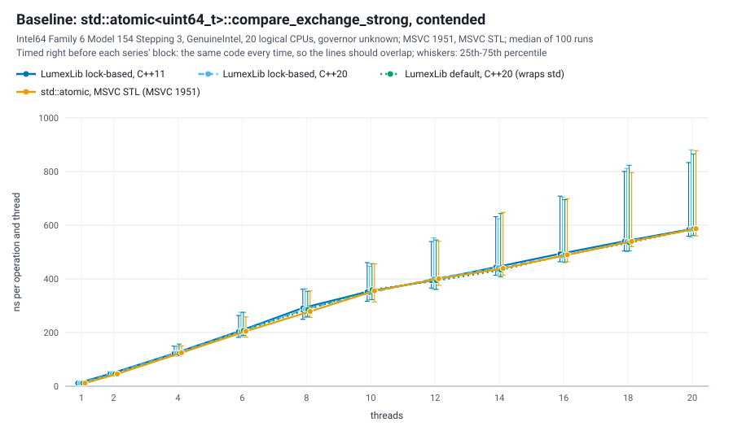
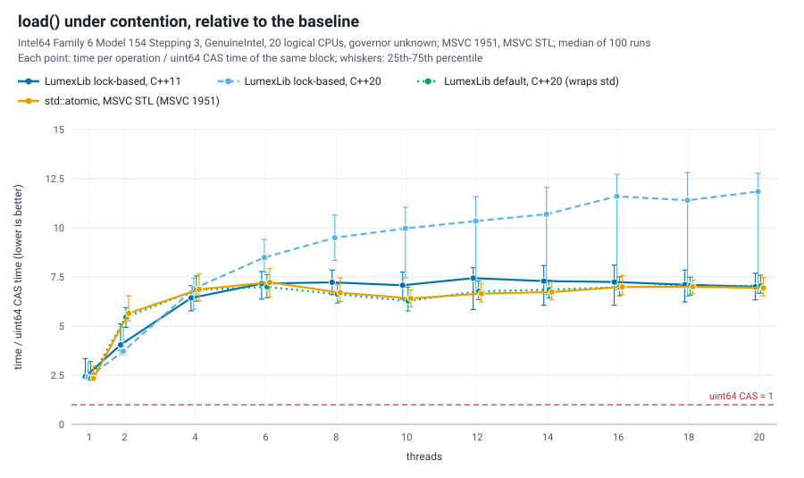
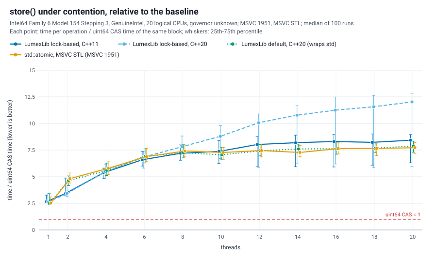
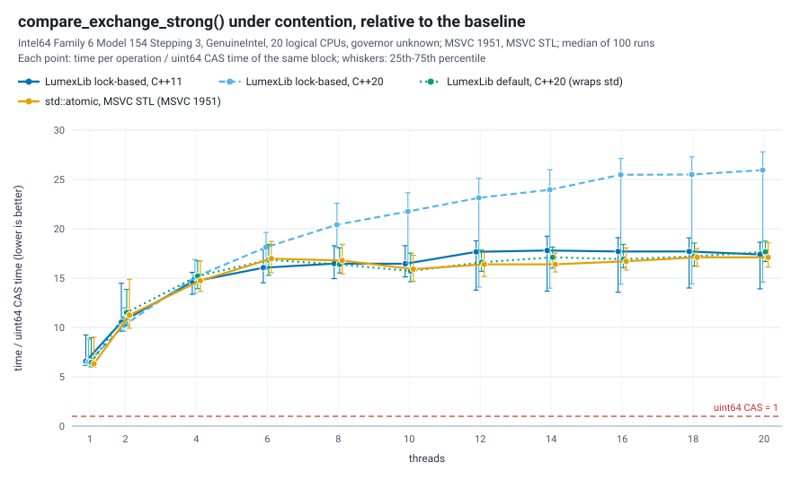
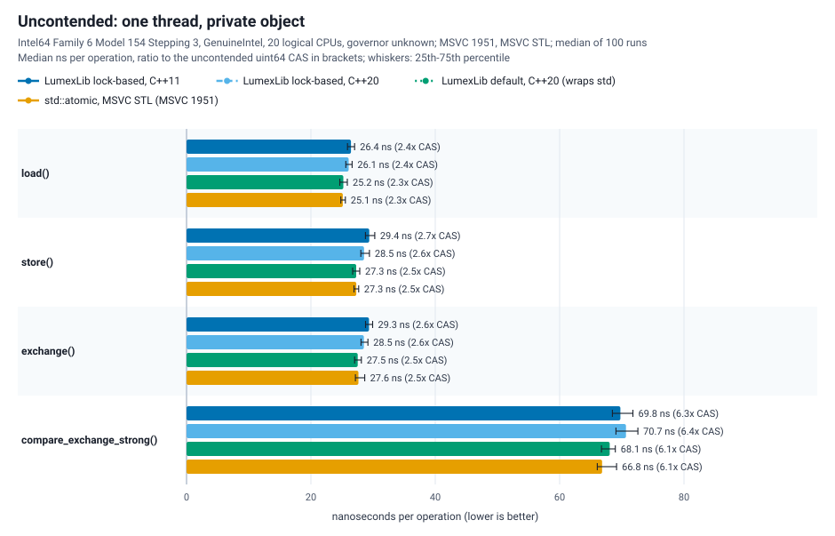

# Atomic shared pointer benchmarks

How LumexLib's `atomic_shared_ptr` behaves under contention, compared with the standard library's `std::atomic<std::shared_ptr<T>>`, measured with the method the author used for his libc++ implementation of `std::atomic<std::shared_ptr<T>>` (llvm-project pull request 194215). Every number is a ratio to `std::atomic<std::uint64_t>::compare_exchange_strong` timed in the same process, with the same threads, right before; a ratio of 10 means ten times the cost of one contended 64-bit compare-exchange.


The numbers behind the charts: [results/atomic_benchmark.md](results/atomic_benchmark.md) (medians and quartiles: [results/atomic_benchmark.csv](results/atomic_benchmark.csv)).

In short, on the machine below: under contention LumexLib's lock-based implementation grows much more slowly than libstdc++ 13's `std::atomic<std::shared_ptr<T>>`; at 20 threads it costs 2.8-3.5 times less for `load ()`, 2.4-2.9 times less for `compare_exchange_strong ()`, 2.0-2.3 times less for `exchange ()` and 1.6-1.8 times less for `store ()`. libstdc++ wins `store ()` with 2 to 6 threads. Uncontended, all four implementations cost 17-22 ns for `load ()`, `store ()` and `exchange ()`, and the lock-based compare-exchange is cheaper (44-47 ns against 57 ns). LumexLib's default selection at C++20, which wraps libstdc++'s type, measures the same as libstdc++ itself.

## What is compared

| Series | What it is | Selected implementation |
| --- | --- | --- |
| LumexLib lock-based, C++11 | `atomic_shared_ptr<int>` in a translation unit built at C++11: the lock-based implementation, sleeping on the striped wait table | `lock_based_table_wait` |
| LumexLib lock-based, C++20 | the lock-based implementation forced at C++20 (`LUMEX_ATOMIC_SMART_PTR_FORCE_LOCK_BASED`), sleeping in `std::atomic::wait` | `lock_based_std_wait` |
| LumexLib default, C++20 | what a C++20 build gets with nothing forced: it wraps the standard library's `std::atomic<std::shared_ptr<T>>` (libstdc++ 13 in the charts above, the MSVC STL in the [Windows series](#msvc-stl)) and adds its own conforming `wait` | `std_backed_std_wait` |
| std::atomic, libstdc++ 13 | `std::atomic<std::shared_ptr<int>>` of the standard library | - |

The harness checks which implementation each series measured: the units fail to compile when a forcing switch did not take effect, `--list` prints the selected inline namespace of every series, and `run_benchmark.py` stops when a LumexLib series measured something else.

Not measured here:

- **A LumexLib lock-free series.** LumexLib ports only the lock-based method of the libc++ implementation; the lock-free method works on libc++'s own control block and cannot run over another library's `std::shared_ptr` (see `lumex/core/atomic/README.md`). The author's measurements of the two libc++ methods are summarized [below](#the-libc-implementation-reference) for reference.
- **The MSVC STL** is a separate series, on another machine: [MSVC STL](#msvc-stl). The `std` series there is MSVC's `std::atomic<std::shared_ptr<T>>`.

## Method

- **Operations**, as in the libc++ benchmark: `load ()`; `store ()` of the same value every time; `exchange ()` of the same value; and `load (relaxed)` followed by `compare_exchange_strong ()` towards the other of two values, the client pattern that exposed the livelock of the libc++ lock-free method.
- **Contention**: 1, 2, 4, 6, ..., 20 threads on one shared object (1 and every even count up to the logical CPUs), plus an uncontended run: one thread on an object of its own.
- **One measurement**: the threads start together, run the operation for 100 ms and stop together; the result is the wall time per operation and thread, the figure Google Benchmark reports for `Threads (N)->UseRealTime ()`.
- **Normalization**: every block (one implementation at one thread count) starts with the baseline loop of the libc++ benchmark, `std::atomic<std::uint64_t>` `load (relaxed)` + `compare_exchange_strong` on one shared word with the same threads; each operation of the block is divided by it. Raw nanoseconds are only compared within one process.
- **Interleaving**: all four implementations live in one executable (LumexLib's inline ABI namespaces keep its selections apart), and at every thread count they take turns, starting with a different one in every repetition, instead of running as blocks.
- **Repetitions**: 100 runs of the program, a 30 s pause before every run but the first; the tables give the median of the per-run ratios with the 25th and 75th percentiles.
- **Checks**: after every measurement the two values the threads passed around must hold their own reference only, so an implementation that leaks a reference fails the run instead of producing a number.

Two differences from the libc++ runner, both consequences of having every implementation in one process: the implementations alternate per block instead of per process, and each block has its own baseline instead of one per process. The baseline chart shows how much the machine drifted between the blocks: its lines should overlap.

## Running

```sh
cmake -S . -B build-bench -DCMAKE_BUILD_TYPE=Release -DLUMEX_BUILD_BENCHMARKS=ON
cmake --build build-bench --target LumexAtomicBenchmark
python benchmarks/atomic/run_benchmark.py --exe build-bench/bin/LumexAtomicBenchmark --quick --out-dir build-bench/atomic-quick
```

`--quick` (3 runs, no pause, 20 ms windows) checks the setup in a few seconds; its numbers are not results, so it writes into the build directory (`--out-dir`) and leaves the committed `results/` alone. Without it the sweep uses the defaults above and takes about an hour and a half on 20 hardware threads. `run_benchmark.py` writes `results/atomic_benchmark.csv` and calls `plot_results.py`, which needs only the Python standard library and writes the SVG charts and the Markdown table next to the CSV. The target `LumexAtomicBenchmarkRun` does all of it and rewrites `results/`. Other options: `--repetitions`, `--settle-seconds`, `--duration-ms`, `--threads 1,2,4,8`, `--raw-csv FILE` (every row of every run).

## Machine and build of these results

| | |
| --- | --- |
| CPU | 12th Gen Intel Core i7-12700K, 20 logical CPUs |
| Governor | `powersave` (CPU frequency scaling enabled) |
| OS, kernel | Astra Linux 1.7.11, Linux 6.1.170-1-generic, glibc 2.28 |
| Compiler | GCC 13.2 with libstdc++ 13, Release, LumexLib's `Portable` level: `-O2 -march=x86-64 -mtune=generic` |
| Run | 2026-10-03, 100 runs, 30 s pauses, 100 ms windows, 91 minutes |
| Load | An interactive desktop session ran throughout (KDE on X11 over xrdp; `kwin_x11` used about 70 % of one CPU). Load average 9.5 at the start (sanitizer runs had ended a minute before) and 12.0 / 10.5 / 10.1 at the end, the benchmark's own threads included. |

The baseline rows agree within 3 % at every thread count (0.97 to 1.03 of their mean, table in [results/atomic_benchmark.md](results/atomic_benchmark.md)): the machine did not drift between the blocks, so the ratios are comparable across the series.

## Reading the results

Ratios to the baseline at 1 / 4 / 8 / 20 threads (medians; lower is better):

| Operation | LumexLib lock-based, C++11 | LumexLib lock-based, C++20 | LumexLib default, C++20 | std::atomic, libstdc++ 13 |
| --- | ---: | ---: | ---: | ---: |
| `load ()` | 2.5 / 3.7 / 4.9 / 8.0 | 2.2 / 4.2 / 6.0 / 10.1 | 2.2 / 7.4 / 14.5 / 27.5 | 2.2 / 7.2 / 14.9 / 28.1 |
| `store ()` | 2.9 / 5.5 / 7.4 / 10.4 | 2.4 / 5.8 / 7.8 / 11.6 | 2.6 / 2.7 / 7.9 / 17.2 | 2.6 / 2.8 / 9.1 / 18.8 |
| `exchange ()` | 2.6 / 4.4 / 7.4 / 10.3 | 2.4 / 5.3 / 7.7 / 11.8 | 2.6 / 5.2 / 11.1 / 22.5 | 2.6 / 5.4 / 10.8 / 23.6 |
| `compare_exchange_strong ()` | 6.1 / 14.8 / 17.1 / 22.7 | 5.8 / 14.9 / 18.9 / 27.4 | 7.4 / 17.5 / 29.2 / 59.8 | 7.5 / 17.4 / 30.0 / 65.5 |

- **Wins under contention.** With many threads the lock-based implementation grows much more slowly than libstdc++'s: at 20 threads `load ()` 8.0-10.1 against 28.1, `exchange ()` 10.3-11.8 against 23.6, `compare_exchange_strong ()` 22.7-27.4 against 65.5, `store ()` 10.4-11.6 against 18.8. Its compare-exchanges also succeed more often (56-61 % of the attempts at 20 threads against 45-46 %).
- **Losses.** `store ()` with 2 to 6 threads: libstdc++ stays at 2.6-2.8 up to 4 threads, where the lock-based implementation needs 3.3-5.8, and it is still slightly cheaper at 6 threads (6.2 against 6.7-7.1); from 8 threads on the lock-based implementation is cheaper. `load ()` and `exchange ()` are even at 2 threads.
- **Uncontended**, in nanoseconds: `load ()` 18.7 / 16.8 / 17.1 / 17.1, `store ()` 22.1 / 18.5 / 19.6 / 19.6, `exchange ()` 20.1 / 18.6 / 20.0 / 19.8, `compare_exchange_strong ()` 46.7 / 44.1 / 57.0 / 56.9 (same column order). The lock-based implementation built at C++20 is the cheapest for all four; the same code built at C++11 costs 8-20 % more for `load ()`, `store ()` and `exchange ()`. The cause was not analysed.
- **C++11 against C++20.** Under contention the C++11 build of the lock-based implementation, which sleeps on the wait table, is cheaper than the C++20 build, which sleeps in `std::atomic::wait` (`compare_exchange_strong ()` 22.7 against 27.4 at 20 threads, `load ()` 8.0 against 10.1). The cause was not analysed either.
- **LumexLib's default at C++20 costs nothing over the library's type.** It wraps libstdc++'s `std::atomic<std::shared_ptr<T>>`; its own `wait` uses a counter that only `notify_*` touches, so `load`, `store`, `exchange` and compare-exchange measure the same as libstdc++ itself (within the quartiles).
- **Against the libc++ methods** (other machine and harness, table below): the lock-based compare-exchange at 20 threads (22.7-27.4) is in the range of the libc++ lock-based method (22.4); the libc++ lock-free method measured 19.5.

## The libc++ implementation (reference)

The author's RFC benchmark of the two libc++ methods (lock-free DWCAS with a split reference count, lock-based spin lock in the control block pointer), on another machine (Intel Core i9-12900H, 20 logical CPUs, Clang 22.1.8, Google Benchmark, `--repetitions 100 --interleave --settle-seconds 30`, both CPU governors). The ratios use the same baseline, but the harness and the machine differ, so they are context, not a series of this benchmark.

| Ratio to baseline CAS | 1 | 2 | 4 | 6 | 8 | 10 | 12 | 14 | 16 | 18 | 20 |
| --- | ---: | ---: | ---: | ---: | ---: | ---: | ---: | ---: | ---: | ---: | ---: |
| `store ()`, lock-free | 3.9 | 4.9 | 3.5 | 3.5 | 3.5 | 3.7 | 3.7 | 3.7 | 3.8 | 3.9 | 4.0 |
| `store ()`, lock-based | 3.5 | 4.9 | 7.1 | 8.1 | 9.6 | 10.6 | 11.5 | 11.7 | 12.1 | 12.2 | 12.0 |
| `compare_exchange_strong ()`, lock-free | 9.9 | 10.2 | 8.9 | 9.8 | 10.1 | 10.5 | 10.9 | 11.2 | 12.4 | 16.3 | 19.5 |
| `compare_exchange_strong ()`, lock-based | 7.4 | 15.3 | 15.6 | 16.3 | 19.1 | 20.7 | 21.6 | 21.9 | 22.2 | 22.8 | 22.4 |
| `load ()`, lock-free | 4.7 | 5.1 | 3.9 | 4.4 | 4.4 | 4.8 | 4.7 | 5.1 | 5.8 | 8.5 | 10.2 |
| `load ()`, lock-based | 2.7 | 9.2 | 4.3 | 4.0 | 4.4 | 5.0 | 5.3 | 5.7 | 5.7 | 6.2 | 6.1 |

Uncontended, in nanoseconds (lock-free / lock-based): `load ()` 36.1 / 20.5, `store ()` 30.4 / 28.8, `exchange ()` 38.3 / 27.7, `compare_exchange_strong ()` 83.1 / 58.8. In short: `store ()` and `compare_exchange_strong ()` favour the lock-free method, more so under contention; `load ()` is about even up to 16 threads and loses to the spin lock at 18 and 20; uncontended, the spin lock is cheaper for all four.

## MSVC STL

The same four series on Windows. The charts above stay the libstdc++ run; these are only the MSVC run. The files carry the `msvc_` prefix so the Doxygen image names stay unique.












The numbers: [results/msvc/atomic_benchmark.md](results/msvc/atomic_benchmark.md) (medians and quartiles: [results/msvc/atomic_benchmark.csv](results/msvc/atomic_benchmark.csv)).

### Machine and build

| | |
| --- | --- |
| CPU | 12th Gen Intel Core i9-12900H, 20 logical CPUs. The CSV header stores what Python's `platform.processor()` returns: `Intel64 Family 6 Model 154 Stepping 3, GenuineIntel` |
| Power plan | Balanced (Windows has no cpufreq governor; the CSV records `governor=unknown`) |
| OS | Windows 11 Pro, build 10.0.26100. The CSV stores `platform.platform()`: `Windows-10-10.0.26100-SP0`, kernel `10` |
| Compiler | MSVC 19.51 (`_MSC_VER` 1951; the benchmark prints `MSVC 1951`) with the MSVC STL, toolset 14.51.36231, Visual Studio 18 Community, x64. Release, LumexLib's `Portable` level: `/O2 /Oi /Ot /Oy /GF`, no `/arch` switch |
| Language mode | The C++20 units are `/std:c++20`. The C++11 unit is `/std:c++14` (MSVC's lowest mode); the CSV records `201402` and `lock_based_table_wait` |
| Run | 2026-10-03, 100 runs, 30 s pauses, 100 ms windows, 93.8 minutes |
| Load | The CSV records `unknown`: `os.getloadavg` does not exist on Windows. An interactive desktop session ran throughout |

The five atomic suites were run on this build before the sweep: 2232 tests, 0 failed. `LumexAtomicSmartPtrConfigTest.GivenConstantInitialization_WhenTheObjectsAreUsed_ThenTheyWork` skips at `.cxx11` and `.cxx17` (`constinit` needs C++20) and runs at `.cxx20`.

The baseline rows agree within 3 % at every thread count (0.975 to 1.021 of their mean, table in [results/msvc/atomic_benchmark.md](results/msvc/atomic_benchmark.md)): the machine did not drift between the blocks. None of the four series reports `is_lock_free`. The default series selected `std_backed_std_wait`, the C++20 lock-based series `lock_based_std_wait`.

### Reading the results

Ratios to the baseline at 1 / 4 / 8 / 20 threads (medians; lower is better):

| Operation | LumexLib lock-based, C++11 | LumexLib lock-based, C++20 | LumexLib default, C++20 | std::atomic, MSVC STL |
| --- | ---: | ---: | ---: | ---: |
| `load ()` | 2.4 / 6.4 / 7.2 / 7.0 | 2.4 / 6.9 / 9.5 / 11.8 | 2.3 / 6.8 / 6.6 / 7.0 | 2.3 / 6.9 / 6.7 / 6.9 |
| `store ()` | 2.7 / 5.4 / 7.2 / 8.4 | 2.6 / 5.5 / 7.8 / 12.0 | 2.5 / 5.6 / 7.3 / 7.9 | 2.5 / 5.8 / 7.4 / 7.7 |
| `exchange ()` | 2.7 / 5.4 / 7.4 / 8.3 | 2.6 / 5.7 / 8.2 / 11.9 | 2.6 / 5.5 / 7.3 / 7.8 | 2.6 / 5.5 / 7.5 / 7.6 |
| `compare_exchange_strong ()` | 6.6 / 14.6 / 16.5 / 17.4 | 6.5 / 15.1 / 20.4 / 25.9 | 6.5 / 15.2 / 16.4 / 17.7 | 6.3 / 14.7 / 16.8 / 17.1 |

- **At 20 threads the MSVC STL does not blow up the way libstdc++ 13 did.** `load ()` of the MSVC STL, of LumexLib's default and of the lock-based C++11 build is 6.9-7.0, against 28.1 for libstdc++ on the other machine. `store ()` is 7.7-8.4, `exchange ()` 7.6-8.3, `compare_exchange_strong ()` 17.1-17.7. The quartiles of those three overlap. The ratios are not a comparison of the two machines: each is divided by that machine's own baseline.
- **The expensive series under heavy contention is the C++20 lock-based build**, which sleeps in `std::atomic::wait`: at 20 threads `load ()` 11.8, `store ()` 12.0, `exchange ()` 11.9, `compare_exchange_strong ()` 25.9. The lower quartile is wide (`load ()` 6.7-12.8 around the median 11.8), so a quarter of the runs sits with the other three and the median does not. The cause was not analysed.
- **At 2 threads the lock-based builds are cheaper.** `load ()` 3.7-4.0 against 5.5-5.7, `store ()` 3.4 against 4.6-4.8. From 4 threads the four series are close, until the C++20 lock-based series pulls away.
- **Uncontended**, in nanoseconds: `load ()` 26.4 / 26.1 / 25.2 / 25.1, `store ()` 29.4 / 28.5 / 27.3 / 27.3, `exchange ()` 29.3 / 28.5 / 27.5 / 27.6, `compare_exchange_strong ()` 69.8 / 70.7 / 68.1 / 66.8 (same column order). The MSVC STL is the cheapest of the four; the lock-based builds cost a few nanoseconds more. On the libstdc++ machine the lock-based compare-exchange was the cheap one.
- **LumexLib's default at C++20 costs nothing over the MSVC STL.** It wraps `std::atomic<std::shared_ptr<T>>`; the medians stay inside each other's quartiles.
- **Successful compare-exchanges at 20 threads:** 65 % for the C++11 lock-based build, 58 % for the C++20 lock-based build, 76 % for the default and 76 % for the MSVC STL.

## Windows (MSVC)

Run on 2026-10-03, as recorded above. The commands below reproduce it. This run used Ninja from a normal PowerShell: `configure_msvc_vcvars()` imports the x64 toolset before `project()`, so a Developer prompt was not required for the suites or the benchmark. The binary directory was outside the source tree, and the targets built were the five suites and `LumexAtomicBenchmark`, so the `compile_commands.json` copy did not run. The consumer fixtures of the CMake cases still need that developer environment and report Skipped without it. The prompt below remains the way to get `cl` for x64 when CMake is not importing it.

Open an **x64 Native Tools Command Prompt for VS 2022**, or a **Developer PowerShell for VS 2022** started for x64 (`Launch-VsDevShell.ps1 -Arch amd64 -HostArch amd64` from `Common7\Tools` of the Visual Studio installation; `cl` must report "for x64"), and change to the LumexLib checkout. The commands are the same in both shells. The consumer fixtures of the CMake cases need that developer environment and report Skipped without it.

Configure and build with Ninja (single configuration, the compiler of the prompt):

```bat
cmake -S . -B build-msvc -G Ninja -DCMAKE_BUILD_TYPE=Release -DLUMEX_BUILD_TESTS=ON -DLUMEX_BUILD_BENCHMARKS=ON
cmake --build build-msvc --parallel
ctest --test-dir build-msvc -R "^atomic\." --output-on-failure --parallel 8
python benchmarks\atomic\run_benchmark.py --exe build-msvc\bin\LumexAtomicBenchmark.exe --quick --no-plot --out-dir build-msvc\atomic-quick
python benchmarks\atomic\run_benchmark.py --exe build-msvc\bin\LumexAtomicBenchmark.exe --out-dir benchmarks\atomic\results\msvc
```

or with the Visual Studio generator (multi-configuration; `-A x64` selects the platform whatever the prompt):

```bat
cmake -S . -B build-vs -G "Visual Studio 17 2022" -A x64 -DLUMEX_BUILD_TESTS=ON -DLUMEX_BUILD_BENCHMARKS=ON
cmake --build build-vs --config Release -- /m
ctest --test-dir build-vs -C Release -R "^atomic\." --output-on-failure --parallel 8
python benchmarks\atomic\run_benchmark.py --exe build-vs\bin\Release\LumexAtomicBenchmark.exe --quick --no-plot --out-dir build-vs\atomic-quick
python benchmarks\atomic\run_benchmark.py --exe build-vs\bin\Release\LumexAtomicBenchmark.exe --out-dir benchmarks\atomic\results\msvc
```

In each block the third command runs the five atomic suites (`LumexAtomicCxx11Tests`, `LumexAtomicCxx17Tests`, `LumexAtomicCxx20Tests`, `LumexAtomicLockBasedCxx20Tests`, `LumexAtomicWaitTableCxx20Tests`; every CTest name starts with `atomic.` and ends with `.cxx11`, `.cxx17`, `.cxx20`, `.lock_based.cxx20` or `.wait_table.cxx20`). `-R "atomic"` instead also runs `cmake.wiring_atomic`, `cmake.atomic_compile_checks`, `cmake.consumer_atomic_cross_module` and the atomic examples. The fourth command is the smoke run (a few seconds, numbers not kept), the fifth the full sweep (100 runs with 30 s pauses, about an hour and a half on 20 hardware threads), which writes into `results\msvc` and leaves the Linux results alone. `python` is Python 3 (`py -3` where `python` is not on `PATH`); the scripts need only its standard library. To draw both series on one chart, pass both CSVs. `plot_results.py` writes the SVG files and the Markdown table next to the first CSV, so the command below replaces the Linux charts; the committed charts are the two separate series. The labels carry the compiler and the CPU, and the ratios make the machines comparable (the nanoseconds do not):

```bat
python benchmarks\atomic\plot_results.py benchmarks\atomic\results\atomic_benchmark.csv benchmarks\atomic\results\msvc\atomic_benchmark.csv
```

On MSVC the C++11 unit of the benchmark builds at C++14 (MSVC's lowest mode), the default series wraps MSVC's `std::atomic<std::shared_ptr<T>>`, and the `std` series measures it directly.
