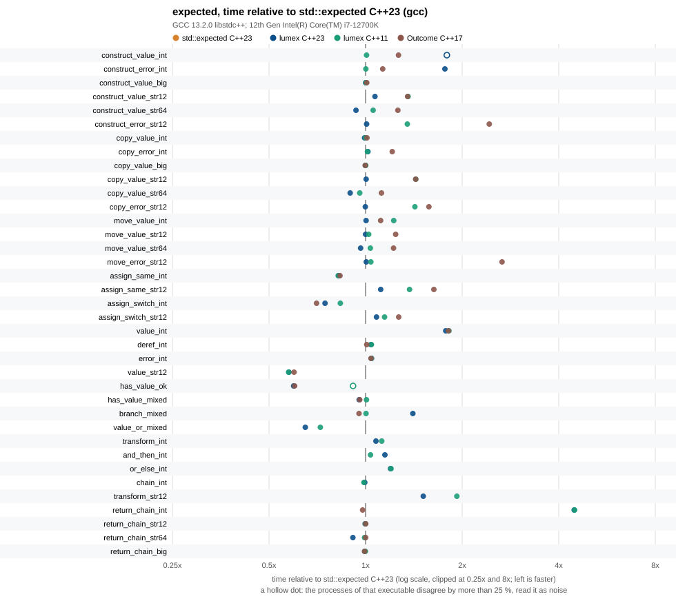
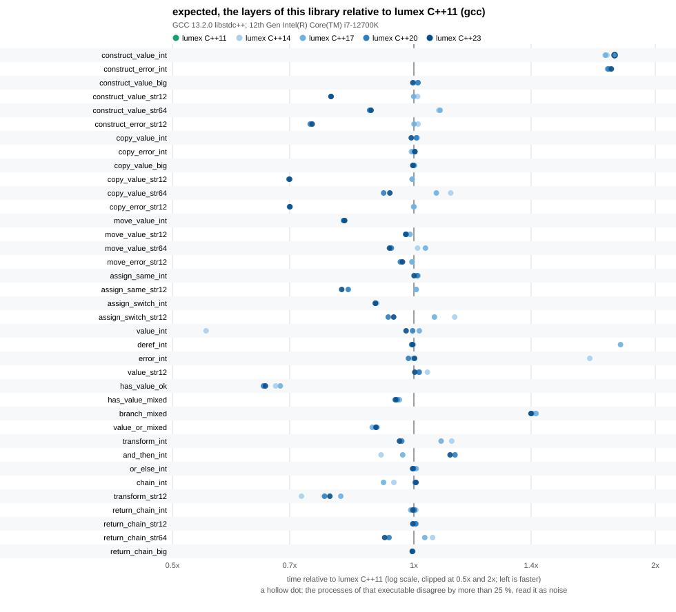
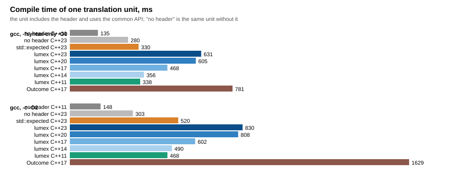

# expected benchmarks

The `expected` of this library (`lumex::core::expected::result::expected`) against `std::expected` of the standard library in use (libstdc++ 13.2, C++23) and `boost::outcome_v2::result` of Boost.Outcome 1.92, on the same scenarios and the same source. The `expected` of this library is measured at C++11, C++14, C++17, C++20 and C++23 (the storage layers and the `constexpr` and `requires` branches differ between the standards, so the layers are compared with each other too); `std::expected` at C++23; Outcome at C++17. Only GCC 13.2 was measured: a second toolchain (Clang with libc++) was not run for this component.







The numbers behind the charts: [results/expected_benchmark.md](results/expected_benchmark.md) (raw data: [results/expected_benchmark.csv](results/expected_benchmark.csv), sizes and properties: [results/sizes.csv](results/sizes.csv), compile times: [results/compile_time.csv](results/compile_time.csv)).

## What is compared

| Alternative | Measured | Notes |
| --- | --- | --- |
| `std::expected` (libstdc++ 13.2.0) | yes, C++23, the baseline | the only standard facility; C++23 |
| `boost::outcome_v2::result` (Boost.Outcome 1.92.0, headers only, `/opt/boost-1.92.0`) | yes, C++17 | `result<T, E, policy::terminate>`; no monadic members, no `value_or`, no `operator*` (`assume_value ()` stands for it); refuses a result whose value and error type are the same type, so the error of the "int" scenarios is `unsigned` and of the "string" scenarios a struct that holds a string, on every side; the default constructor of `result<void, E>` is deleted |
| `tl::expected` | no | not installed on this machine (a search for `expected.hpp` found only libstdc++'s `<expected>`); nothing was vendored |
| `boost::leaf`, `outcome::outcome` and the rest of Boost.Outcome | no | different designs (`leaf` is an error-handling framework, not a result type) |

## Method

- One source, `bench_expected.cpp`, compiled once per implementation and standard with `-DBENCH_EXPECTED_IMPL=1|2|3` (`bench_expected_impl.hpp` maps it to the type under test and defines `ok<X> (...)`, `err<X> (...)`, `ok_void<X> ()` and `deref (x)`). Every variant is built with the flags of the Release profile of the library, whose effective optimization is `-O2 -g -DNDEBUG -fomit-frame-pointer -march=x86-64 -mtune=generic` (the profile also adds the warning flags of the library; the benchmark builds without warnings, and also with `-Wall -Wextra -Wpedantic -Wconversion -Wsign-conversion -Wshadow -Wold-style-cast` on C++11, 14, 17, 20 and 23). There are no sanitizers. `LUMEX_ASSERT` is active as in every build of the library (it aborts in every build, `NDEBUG` included).
- Scenarios (the unit of an operation is in the description column of the results): construction in place from a value or an error and destruction; copy; construction plus move construction; copy assignment of the same alternative and of the other alternative; `value ()`, `operator*`, `error ()`, `has_value ()` over an array of 1 024 (all values, all errors, one error in eight in a fixed pseudo-random order) and the usual `if (has_value ()) *x else x.error ()`; `value_or`; `transform`, `and_then`, `or_else` and the three in a row; four nested `noinline` calls that return the result by value. Types: `<int, unsigned>`, `<std::string, unsigned>` with 12 characters (no allocation) and with 64 (an allocation), `<int, std::string>`, `<std::string, text_error_t>`, `<std::array<int, 16>, unsigned>` (64-byte value).
- `sizeof`, `alignof` and the properties trivially copyable, trivially destructible, standard layout and nothrow move constructible of 16 types are written to `sizes.csv` by every executable.
- Equal work: every scenario returns a checksum of what it computed from the same inputs; `run_benchmark.py` compares the checksums of all executables and stops when two of them differ. The optimizer is kept from deleting or hoisting the work with empty `asm` statements that read the objects built in the loops (and clobber memory) and with inputs (values, pointers, sizes) that pass through `asm`. The arrays are built at run time. Not covered by this check: the generated code can still differ in what it keeps in registers; the asm statements only prevent removal.
- A scenario is calibrated until one run lasts at least 20 ms, runs once as warm-up and 15 times for the numbers. `run_benchmark.py` runs every executable `--passes` times (default 5), one pass over all executables after the other, and keeps the median of the pass medians as the time, the smallest and the largest pass median as the spread between processes, and the smallest minimum and largest maximum of the repetitions. A dagger in the tables marks a time whose largest pass median is more than 25 % above the smallest; the spread over all scenarios is a median of 1.02 (largest 1.28), so a difference below 10 % is not a result.
- The process is pinned to one CPU (CPU 4, a performance core) with `taskset`; the whole run is done under the build lock of the machine, so nothing else compiles or tests meanwhile.
- Compile time: `compile_time.cpp` includes the header and uses the common API for three types; `run_benchmark.py --compile-time` measures the wall time of `-fsyntax-only -O0` and of `-c -O2` of that unit (median of 7), next to the same unit without the header (`no header`), which is only measured at C++11 and C++23.

## Running

```sh
cmake -S . -B build-bench -DCMAKE_BUILD_TYPE=Release -DCMAKE_CXX_COMPILER=g++ \
      -DLUMEX_BUILD_BENCHMARKS=ON \
      -DLUMEX_BENCH_BOOST_INCLUDE_DIR=/opt/boost-1.92.0/include
cmake --build build-bench --target LumexExpectedBench_lumex_cxx11 LumexExpectedBench_lumex_cxx14 \
      LumexExpectedBench_lumex_cxx17 LumexExpectedBench_lumex_cxx20 LumexExpectedBench_lumex_cxx23 \
      LumexExpectedBench_std_cxx23 LumexExpectedBench_outcome_cxx17
python benchmarks/expected/run_benchmark.py --build-dir gcc=build-bench --passes 5 --cpu 4 \
       --compile-time --compiler "gcc=g++" --boost-include /opt/boost-1.92.0/include
```

`run_benchmark.py` writes `results/expected_benchmark.csv`, `results/sizes.csv`, `results/compile_time.csv` and, through `plot_results.py` (Python standard library only), the Markdown tables and the SVG charts. The target `LumexExpectedBenchmarkRun` runs the executables of one build tree and writes into that build tree, so it never overwrites the committed results. Boost is optional: without `boost/outcome/result.hpp` the Outcome variant is skipped with a message. The runs took about 30 minutes with 5 passes.

## Results

Measured on an Intel Core i7-12700K (Linux 6.1, pinned to CPU 4, frequency governor `powersave` of `intel_pstate`), GCC 13.2.0 with libstdc++, Boost 1.92.0 (headers only), 5 passes, October 2026. The full tables, with the absolute time and the ratio of every variant in every scenario, are in [results/expected_benchmark.md](results/expected_benchmark.md); the main findings:

- **Size: the same.** In 13 of 16 type pairs all three have the same `sizeof` as `std::expected`; Outcome is larger for `<char, unsigned char>` (6 against 2 bytes), `<string, text_error_t>` (72 against 40) and `<string, error_code>` (56 against 40). The layout of this library is one `bool` and a union, as the standard describes.
- **Trivial copyability: this library is better than libstdc++.** For types whose value and error are trivially copyable, `expected` of this library is trivially copyable (as [expected.object.cons] and [expected.object.assign] say), `std::expected` of libstdc++ 13.2 is not (`std::is_trivially_copyable` is false for all 10 trivially copyable pairs of `sizes.csv`). Outcome is trivially copyable too.
- **Overall: on par with `std::expected`, with exceptions.** The geometric mean of the time ratio over the 37 scenarios, against `std::expected` C++23, is 1.07 for this library at C++20 and C++23, 1.11 at C++11, 1.13 at C++14, 1.15 at C++17 and 1.14 for Outcome (31 scenarios). Nine scenarios of C++23 are more than 10 % slower and six more than 10 % faster. Most of the large single ratios (the sub-nanosecond ones) are not properties of the library: for example `value_int` is 0.36 ns at C++14 and 0.65 to 0.67 ns at C++11, 17, 20 and 23 for source that is identical in all five (`std::expected` is also 0.36 ns, Outcome 0.66 ns), `deref_int` is 0.66 ns only at C++17, `construct_value_int` 0.56 ns at C++11 and 0.97 to 0.99 ns elsewhere. These loops are a few instructions; where the code and the loop land in the executable decides, and the numbers are stable between passes but not between executables (the span benchmark of this library found the same).
- **The one large, reproducible loss: returning a trivially copyable `expected` through calls.** `return_chain_int` (four nested `noinline` calls returning `expected<int, unsigned>`) takes 28.7 ns with this library at C++23 against 6.4 ns for `std::expected` and 6.3 ns for Outcome: 4.5 times, the same at all five standards. The generated code explains it: the object is trivially copyable, so GCC returns it in a register, but the library builds it with a 4-byte store for the value and a 1-byte store for the flag into a stack slot and then reloads the 8 bytes with one `movq` (`level2` of the chain), which is the likely cause (a store-to-load forwarding stall at every level; not confirmed with a performance counter); the code of `std::expected` builds the 64-bit value in a register (`btsq`) and does not go through the stack. The chain with a 12-character string (44 ns), a 64-character string (21 ns) and a 64-byte value (17 ns) is on par (0.91 to 1.05), because those objects (40 and 68 bytes) are returned through memory. This is a defect to look at in `lumex/core/expected/result/ExpectedStorage.hpp` (not changed here); other compilers were not measured.
- **Strings: C++20 and newer are as fast as `std::expected`, older standards 35 to 43 % slower for short strings.** Construction, copy and assignment of a 12-character string are 1.35 to 1.43 times `std::expected` at C++11, 14 and 17 (3.5 against 2.4 ns for the copy), and equal at C++20 and C++23. Outcome at C++17 shows the same numbers, so this is the cost of `std::string` below C++20 in libstdc++ (the constructors are not `constexpr` and not as fully inlined), not of the library. For 64 characters (an allocation) the ratio is 0.88 to 1.14 and not distinguishable from noise.
- **Observers.** `has_value ()` is 0.35 ns per element (0.36 for `std::expected`, 0.59 in the predictable case, which is noise between executables, the layers range from 0.35 to 0.54). `deref_int` and `error_int` are equal to `std::expected` except in the two executables mentioned above. `branch_mixed` (test, then dereference or take the error) is 0.88 ns at C++14 to C++23 and 0.63 ns at C++11 and for `std::expected`: 1.4 times; the `LUMEX_ASSERT` in `operator*` and `error ()` is a branch that the compiler can drop after a `has_value ()` test, and does at C++11, but it did not in the other four builds. `value ()` throws `bad_expected_access` on an error, as the standard says; `value_str12` is 0.4 ns against 0.70 ns for `std::expected`, `value_or_mixed` 0.56 against 0.86 ns, both faster by 35 to 42 %; the reason was not investigated, read the direction only.
- **Monadic operations: slower by 0 to 50 % at C++23.** `transform_int` 1.08 times, `and_then_int` 1.15, `or_else_int` 1.20, the three in a row 0.99, `transform_str12` (a `const` lvalue holding a string, the function reads its size) 1.51 at C++23 and 1.93 at C++11. Outcome has no monadic members. The differences are small in absolute terms (0.1 to 0.5 ns per element).
- **Assignment.** Value over value `<int, unsigned>` 0.82 times `std::expected` (0.76 against 0.93 ns), switching the alternative 0.75 (0.52 against 0.70 ns), a string value over a string value 1.11 at C++23, switching with strings 1.08.
- **The compile time is the price.** The unit of `compile_time.cpp` costs, over the same unit without the header (`-fsyntax-only -O0`, GCC 13.2): at C++11 +203 ms for this library (338 against 135 ms), at C++23 +351 ms for this library (631 against 280 ms) and +50 ms for `std::expected` (330 ms); Outcome at C++17 takes 781 ms. With `-c -O2`: lumex C++11 468 ms (no header: 148), lumex C++23 830 ms (no header: 303), `std::expected` 520 ms, Outcome 1 629 ms. The cost of this library rises with the standard (C++11 338, C++14 356, C++17 468, C++20 605, C++23 631 ms `-fsyntax-only`); the cause (the `requires` branches and the headers the newer standards pull in) was not measured separately.

## Caveats

- The numbers are for this machine and this compiler. They are not a promise about MSVC, Clang (libc++ or libstdc++), other CPUs or other versions: run the benchmark there (`Running`). `std::expected` is measured with libstdc++ 13.2 only; another standard library has another layout of the same type.
- The scenarios measure the type in a loop with the optimizer held back by empty `asm` statements. They show the cost of the interface, not of a whole program, and a fraction of a nanosecond is one or two instructions or cycles.
- Outcome is configured with `policy::terminate` (checked observers). Its default policy for an arbitrary error type would not check, which would make `value ()` cheaper and unsafe; and Outcome's `ok`/`err` in the scenarios use `in_place_type`.
- Six scenarios are not run for Outcome (`value_or` and the five monadic ones): it has no such members and none was emulated.
- `std::expected` and this library differ in what a precondition violation does: `operator*` and `error ()` of this library abort through `LUMEX_ASSERT` in every build; the standard leaves it undefined (libstdc++ asserts only with `_GLIBCXX_ASSERTIONS`), which is part of what the observer rows measure.
- Two of the 253 results (`construct_value_int` at C++23 and `has_value_ok` at C++11) carry a dagger in the tables: their passes disagree by more than 25 %.
