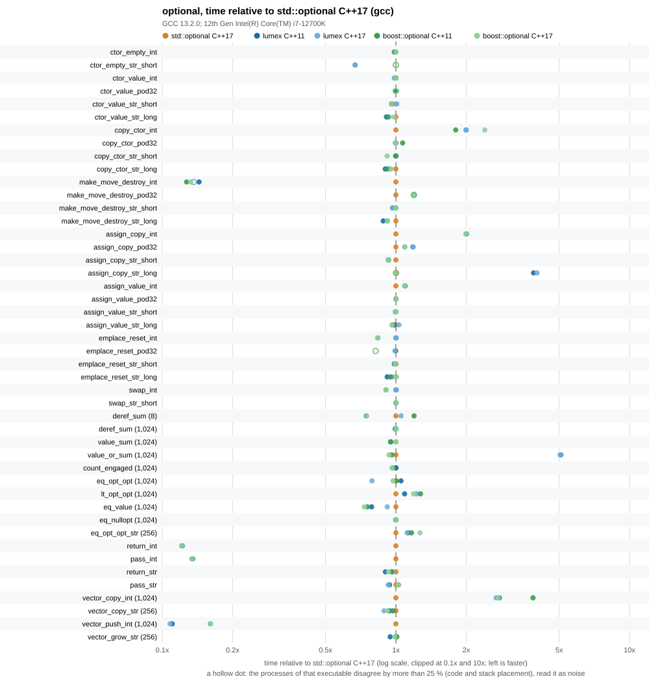
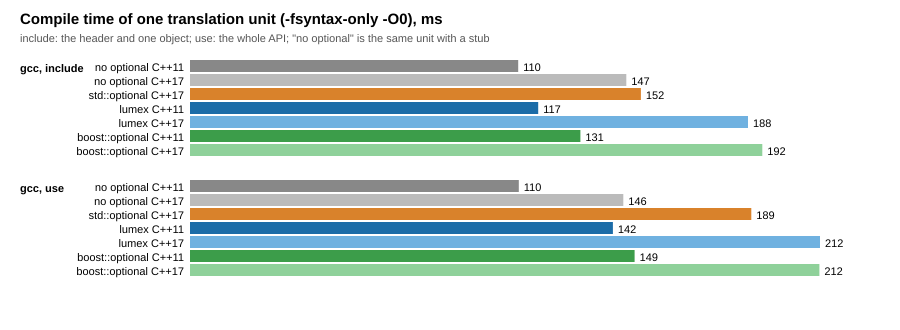

# optional benchmarks

The optional of this library (`lumex::core::optional::opt::optional`) against `std::optional` of the standard library in use and `boost::optional` of Boost.Optional, on the same scenarios and the same source. The optional of this library is measured at C++11 and at C++17 (it is its own class at both and never becomes `std::optional`); `std::optional` at C++17; `boost::optional` at C++11 and at C++17. Only one toolchain was measured: GCC 13.2.0 with libstdc++. Clang with libc++ was not measured (the build supports it: a second build tree with `--build-dir clang=...`), so nothing here says how Clang or MSVC compile the same code.





The numbers behind the charts: [results/optional_benchmark.md](results/optional_benchmark.md) (raw data: [results/optional_benchmark.csv](results/optional_benchmark.csv), layout and traits: [results/optional_traits.csv](results/optional_traits.csv), compile times: [results/compile_time.csv](results/compile_time.csv)).

## Method

- One source, `bench_optional.cpp`, compiled once per implementation and standard with `-DBENCH_OPTIONAL_IMPL=1|2|3` (`bench_optional_impl.hpp` maps it to the optional under test). Every variant is built with the same flags of the Release profile of the library (`-O2 -DNDEBUG -march=x86-64 -mtune=generic` and the library warnings); there are no sanitizers. The build has no warnings.
- Scenarios (the unit of an operation is in the description column of the results): construction empty and from a value, copy construction, construct-move-destroy, copy assignment and value assignment to an engaged optional, `emplace` and `reset`, `swap`, each for `int` (trivial), a 32-byte trivially copyable struct, a short `std::string` (small-buffer) and a 80-character `std::string` (heap); sums by `*o`, `value ()` and `value_or` and counts of engaged elements over 8 and 1 024 `optional<int>`; `==` and `<` between optionals, `==` with a value and with `nullopt`; a `noinline` function that returns an `optional<int>` or `optional<std::string>` and one that takes it by value (the calling convention); copying a `std::vector` of 1 024 `optional<int>` and 256 `optional<std::string>`, `push_back` after `reserve` and `push_back` with reallocations.
- Equal work: before timing, every scenario is run for a few iterations and its checksum is compared with a reference that uses plain values and flags only. The checksums are written to the CSV and `run_benchmark.py` compares them across all executables; different checksums stop the run.
- The optimizer is kept from deleting or hoisting the work with empty `asm` statements that read the objects (`"m"`) and clobber memory, and with values passed through `asm` so that they are not known at compile time. The objects are therefore forced into memory at the marked points: a result that a compiler could keep in registers is stored and loaded. This is the same for all implementations, but it changes what is measured for a small trivially copyable type (see the finding about `optional<int>` below).
- A scenario is calibrated until one run lasts at least 20 ms, then runs once as warm-up and 15 times for the numbers. The CSV keeps the median, the minimum and the maximum time per operation of the 15 repetitions; `run_benchmark.py` runs every executable `--passes` times (here 5), one pass over all executables after the other, and keeps the median of the medians, the smallest minimum and the largest maximum. The table keeps the best pass and marks (dagger) a value whose slowest pass was more than 25 % slower.
- The process is pinned to one CPU with `taskset` (`--cpu 3`).
- Every timing run was made under the build lock of the workstation, so the machine was otherwise idle.
- The baseline of the ratios is `std::optional` at C++17. Every table cell is the absolute time in nanoseconds and, in parentheses, the ratio to the baseline (below 1.00 is faster than `std::optional`).
- Layout: the executables write `sizeof`, `alignof` and a few traits of `optional<T>` for ten types (`--traits`).
- Compile time: `compile_time.cpp` is compiled with `-fsyntax-only -O0` in two units, `include` (the header and one declared object) and `use` (construction, observers, modifiers, comparisons, `swap`, vectors of optionals, `std::hash`), next to the same unit with a stub instead of an optional; the median of 7 runs.

## Boost

Boost is optional and header-only: the boost variants need `boost/optional.hpp` and are skipped, with a message, when CMake finds none. Pass the include directory with `-DLUMEX_BENCH_BOOST_INCLUDE_DIR=<dir>` or point `find_package(Boost CONFIG)` at an installation. Nothing of Boost is linked or vendored. On the workstation of the committed results Boost 1.92.0 is installed in `/opt/boost-1.92.0` (only its headers are used); the system also has Boost 1.67 in `/usr/include`, which was not used.

## Running

```sh
cmake -S . -B build-bench-gcc -DCMAKE_BUILD_TYPE=Release \
      -DCMAKE_CXX_COMPILER=g++ -DLUMEX_BUILD_BENCHMARKS=ON \
      -DLUMEX_BENCH_BOOST_INCLUDE_DIR=/opt/boost-1.92.0/include
cmake --build build-bench-gcc --target LumexOptionalBench_lumex_cxx11 \
      LumexOptionalBench_lumex_cxx17 LumexOptionalBench_std_cxx17 \
      LumexOptionalBench_boost_cxx11 LumexOptionalBench_boost_cxx17
python benchmarks/optional/run_benchmark.py --build-dir gcc=build-bench-gcc \
       --compile-time --compiler "gcc=g++" \
       --boost-include /opt/boost-1.92.0/include --cpu 3 --compile-repeats 7
```

`run_benchmark.py` writes `results/optional_benchmark.csv`, `results/optional_traits.csv`, `results/compile_time.csv` and, through `plot_results.py` (Python standard library only), the Markdown table and the SVG charts. The target `LumexOptionalBenchmarkRun` runs the executables of one build tree and writes into that build tree, so it never overwrites the committed results.

## Reading the results

Measured on an Intel Core i7-12700K (Linux 6.1, pinned to one performance core), GCC 13.2.0 with libstdc++, Boost 1.92.0 (headers only), 5 passes, October 2026. 46 scenarios. The full table is in [results/optional_benchmark.md](results/optional_benchmark.md). A small absolute time (a few tenths of a nanosecond) is a handful of instructions and its ratio is coarse: 0.23 ns against 0.47 ns is one extra instruction or two.

- **Overall the three are close, and the geometric mean hides large differences in both directions.** The geometric mean of the time ratio over the 46 scenarios is 0.926 for lumex C++17 against `std::optional` C++17 and 0.916 for lumex C++11; lumex C++17 against `boost::optional` C++17 is 1.064. The number of scenarios where lumex is more than 10 % slower than `std::optional` is 9 (C++17) and 8 (C++11), more than 10 % faster 7 and 8. For the types that are not trivially copyable (`std::string`) the three are within a few percent in almost every scenario.
- **Where lumex is slower than `std::optional`:**
  - `value_or` over a mixed array of `optional<int>`: 2 715 ns against 535 ns for 1 024 elements (5.1x). `std::optional` and `boost::optional` compile to a conditional move; the code of this library (`m_has_value ? **this : static_cast<T> (...)`) is compiled to a branch, and the data (two thirds engaged, in a fixed pseudo-random order) mispredicts it. With predictable data the difference is not expected, which was not measured. This is a defect of the generated code of the library, reported, not changed here.
  - Copy assignment of an engaged `optional<std::string>` of 80 characters to an engaged one: 12.8 ns against 3.3 ns (3.9x with C++11, 4.0x with C++17). The library destroys the old value and constructs a new one from a copy (a heap allocation), where `std::optional` and `boost::optional` assign the contained value and reuse the buffer. For a short (small-buffer) string, and for `int`-like types, there is no such cost.
  - Copying a `std::vector` of 1 024 `optional<int>`: 539 ns against 194 ns (2.8x): `optional<int>` of this library is not trivially copyable, so the vector copies element by element where `std::optional<int>` is copied with one `memmove`. `boost::optional<int>` is not trivially copyable either (3.9x at C++11, 2.8x at C++17).
  - Copy construction and copy assignment of `optional<int>`: 0.47 ns against 0.23 ns (2.0x), with a branch on the flag where the trivially copyable `std::optional<int>` copies eight bytes.
  - `make_move_destroy` and `assign_copy` of the 32-byte struct: 1.19x to 1.20x.
  - `<` between two mixed `optional<int>` arrays: 1.09x (C++11) and 1.23x (C++17); `==` between two `optional<std::string>` arrays: 1.12x to 1.13x. The C++11 and the C++17 builds of the same code differ here by placement (`eq_opt_opt` is 1.05x slower than std in the C++11 build and 0.79x in the C++17 build), so read single entries of this size with care.
- **Where lumex is faster:**
  - Functions that return or take an `optional<int>` by value, and the construct-move-destroy of an `optional<int>` and `push_back` of `optional<int>` into a vector: 0.11x to 0.14x of the time of `std::optional`, so 7x to 9x faster, and equal to `boost::optional`. This is not a merit of the library; it is a cost of `std::optional<int>` in this build. GCC 13.2 builds the trivially copyable `std::optional<int>` with a 4-byte store of the value and a 1-byte store of the flag and then copies it with one 8-byte load (it is passed and returned in a register, `find_int` returns it in `rax`). The 8-byte load that follows two narrower stores cannot be forwarded from the store buffer on this CPU and waits for them to retire (about 5 ns instead of 0.6 ns). The assembly of `run_return_int` and `run_make_move_destroy` shows that sequence. In a program where the value stays in registers the stall does not occur, and the barriers of this benchmark (objects forced into memory) create that situation more often than a real program does, so do not read 7x as a general speed-up. Clang or another GCC version may behave differently; it was not measured. The cost does not exist for the types that are not trivially copyable (`return_str`, `pass_str`: 0.90x to 0.97x and 0.93x to 0.94x).
  - `push_back` of `optional<int>` after `reserve`: 503 ns against 4 557 ns for 1 024 elements, the same cause.
  - `==` with a value over `optional<int>`: 535 ns (C++11) and 624 ns (C++17) against 680 ns (0.79x, 0.92x); `boost::optional` is 0.73x to 0.76x. The reason was not investigated.
  - 80-character strings: construction, copy construction and construct-move-destroy are 0.88x to 0.94x in the lumex columns and 0.92x to 0.98x for `boost::optional`. Both move together, so this is more likely the placement of the loop or the allocator than a property of the optional.
- **Same as `std::optional` within 10 %** (the rest): empty construction, construction from a value, `emplace` and `reset`, `swap`, `==` with `nullopt`, `value ()`, `*o`, counting engaged elements, `vector_grow_str`, `vector_copy_str`.
- **C++11 build against C++17 build of lumex:** geometric mean 0.989; the code is the same at both standards except for the conversions to and from `std::optional`, and the differences (`eq_opt_opt` 1.33x, `deref_sum` of 8 elements 0.71x) are placement.
- **Layout.** `sizeof (optional<T>)` is equal to `std::optional<T>` and `boost::optional<T>` for all ten types measured (`int` 8, `double` 16, 32-byte struct 40, `std::string` 40, `std::unique_ptr<int>` 16, `std::shared_ptr<int>` 24). The properties differ: `optional<int>` of this library is not trivially copyable, not trivially destructible and not trivially copy constructible for any `T`, where `std::optional<int>` is all three. `boost::optional<int>` is trivially destructible but not trivially copyable.
- **The compile time** is the price in a few cases only. Over the same unit with a stub instead of an optional (`-fsyntax-only -O0`): the `include` unit costs +5 ms for `std::optional` C++17, +7 ms for lumex C++11, +41 ms for lumex C++17 and +21 ms (C++11) and +45 ms (C++17) for `boost::optional`; the `use` unit costs +43 ms for `std::optional` C++17, +32 ms for lumex C++11, +66 ms for lumex C++17, +39 ms and +66 ms for Boost. At C++17 the header of this library includes `<optional>` (for the conversions) on top of `<functional>`, `<stdexcept>` and the rest, which is why it is slower than `std::optional` alone there; at C++11 it is cheaper than Boost. The difference is 5 to 10 % from run to run and a few tens of milliseconds, not a reason to choose one over the other.

## Caveats

- The numbers are for this machine and this compiler, one toolchain (GCC 13.2.0, libstdc++). They are not a promise about Clang, MSVC, other CPUs or other versions: run the benchmark there (`Running`).
- The scenarios measure an optional in a loop with the optimizer held back by empty `asm` statements. They show the cost of the interface, not of a whole program.
- `==`, `<` and `value_or` scenarios use a fixed pseudo-random pattern (two thirds engaged); branch behaviour depends on the data.
- The move constructor of this library leaves the source empty (the standard's leaves it holding a moved-from value). `make_move_destroy` therefore includes the destruction of the moved-from value for lumex at the move and for `std::optional` at the end of the scope; the total work is the same.
- Boost 1.92.0 was built with the system GCC 8, but only its headers are used.
- The compile times are the median of 7 runs of one unit on an idle machine.
