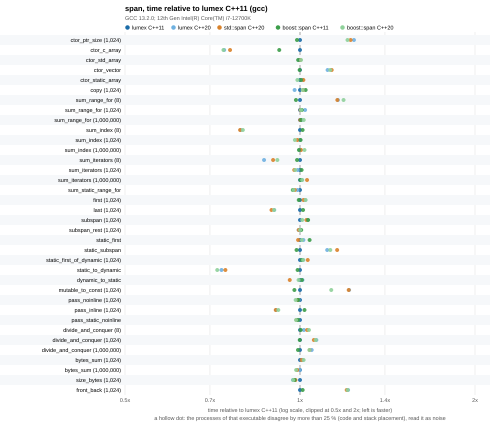
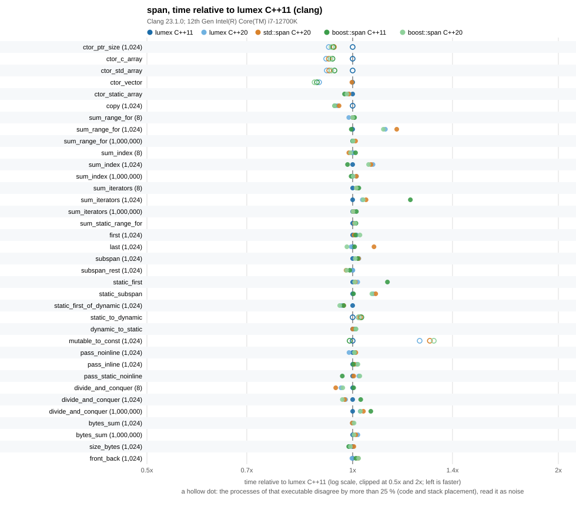
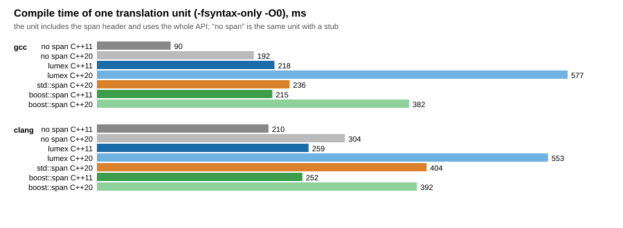

# span benchmarks

The span of this library (`lumex::core::span::view::span`) against `std::span` of the standard library in use and `boost::span` of Boost.Core, on the same scenarios and the same source. The span of this library is measured at C++11 and at C++20; `std::span` at C++20; `boost::span` at C++11 and at C++20. A standard library needs its own compiler, so there are two toolchains:

- **GCC** with libstdc++ (`std::span` of libstdc++),
- **Clang** with libc++ (`std::span` of libc++).







The numbers behind the charts: [results/span_benchmark.md](results/span_benchmark.md) (raw data: [results/span_benchmark.csv](results/span_benchmark.csv), compile times: [results/compile_time.csv](results/compile_time.csv)).

## Method

- One source, `bench_span.cpp`, compiled once per implementation and standard with `-DBENCH_SPAN_IMPL=1|2|3` (`bench_span_impl.hpp` maps it to the span under test). Every variant of a toolchain is built with the same flags of the Release profile of the library; there are no sanitizers.
- Scenarios (the unit of an operation is in the description column of the results): construction from a pointer and a count, a built-in array, a `std::array`, a `std::vector` and a static-extent array; copy; sums by range-for, by `operator[]` and by iterators over 8, 1 024 and 1 000 000 ints and over a static extent; `first`, `last`, `subspan` with run-time and `first<N>`, `subspan<O, N>` with compile-time counts; static to dynamic, dynamic to static and mutable to const conversions; passing a span by value to a `noinline` and to an inlined function; a recursive sum with `first` / `subspan` halves down to one element (many tiny spans); `as_bytes` sums; `size_bytes`; `front` and `back`; and, for the span of this library at C++20 only, conversions from a `std::span<int>`, to a `std::span<int>` and from a `span<byte const>` to a `std::span<std::byte const>` (`from_std_span`, `to_std_span`, `bytes_to_std_span`; the other implementations do not have the pair of types, so these rows have no ratio and are listed apart).
- Equal work: before timing, every scenario is run for a few iterations and its checksum is compared with a reference that uses raw pointers only. The checksums are written to the CSV and `run_benchmark.py` compares them across all executables of all toolchains; different checksums stop the run.
- The optimizer is kept from deleting or hoisting the work with empty `asm` statements that read the spans (`"m"`) and clobber memory, and with values passed through `asm` so that sizes and pointers are not known at compile time (`_ReadWriteBarrier` and a volatile on MSVC).
- A scenario is calibrated until one run lasts at least 20 ms, then runs once as warm-up and 15 times for the numbers. The CSV keeps the median, the minimum and the maximum time per operation of the 15 repetitions; `run_benchmark.py` runs every executable `--passes` times (default 5), one pass over all executables after the other, and keeps, per scenario, the lowest median of any pass (the best pass), the highest median (to mark unstable cells), the smallest minimum and the largest maximum. `--quick` runs one pass with 3 short repetitions as a smoke check.
- The process is pinned to one CPU with `taskset` (`--cpu`) when available.
- Compile time: `compile_time.cpp` includes the span header and uses the whole API; `run_benchmark.py --compile-time` measures the wall time of `-fsyntax-only -O0` of that unit per compiler and variant (median of the repeats), next to the same unit with a stub instead of a span.
- The results are only meaningful for a Release build without sanitizers, on an otherwise idle machine.

## Boost

Boost is optional and header-only: the boost variants need `boost/core/span.hpp` (Boost 1.78 or later) and are skipped, with a message, when CMake finds none. Pass the include directory with `-DLUMEX_BENCH_BOOST_INCLUDE_DIR=<dir>` or point `find_package(Boost 1.78 CONFIG)` at an installation (`CMAKE_PREFIX_PATH`, `Boost_DIR`). Nothing of Boost is linked or vendored. On the workstation of the committed results Boost 1.92.0 is installed in `/opt/boost-1.92.0` (built with the system GCC 8; only its headers are used).

## Running

```sh
cmake -S . -B build-bench-gcc -DCMAKE_BUILD_TYPE=Release \
      -DCMAKE_CXX_COMPILER=g++ -DLUMEX_BUILD_BENCHMARKS=ON \
      -DLUMEX_BENCH_BOOST_INCLUDE_DIR=/opt/boost-1.92.0/include
cmake --build build-bench-gcc
# the same with clang++ (libc++) in build-bench-clang
python benchmarks/span/run_benchmark.py \
       --build-dir gcc=build-bench-gcc --build-dir clang=build-bench-clang \
       --compile-time --compiler "gcc=g++" --compiler "clang=clang++ -stdlib=libc++" \
       --boost-include /opt/boost-1.92.0/include --cpu 3
```

`run_benchmark.py` writes `results/span_benchmark.csv`, `results/compile_time.csv` and, through `plot_results.py` (Python standard library only), the Markdown table and the SVG charts. The target `LumexSpanBenchmarkRun` runs the executables of one build tree and writes into that build tree, so it never overwrites the committed results; the committed results need both toolchains as above.

## Reading the results

Measured on an Intel Core i7-12700K (Linux 6.1, pinned to one performance core), GCC 13.2.0 with libstdc++ and Clang 23.1.0 with libc++, Boost 1.92.0 (headers only), `-O2 -DNDEBUG` (the flags of the Release profile of the library), 5 passes, in October 2026. The full tables are in [results/span_benchmark.md](results/span_benchmark.md); the main findings:

- **The code of the scenarios is the same in every implementation.** The object files of the five GCC and the five Clang executables were disassembled and the loops of every `run_*` function compared instruction by instruction (addresses normalized). With GCC all 36 scenarios common to the five executables have the same instructions in the five variants of the span, apart from differences of no consequence in `std::span`: the operands of one `cmp` swapped in `sum_range_for`, `sum_iterators` and `bytes_sum`, and two `punpck` instructions exchanged in `sum_static_range_for`. With Clang the same holds except for register choice in `ctor_vector`, `last` and `sum_iterators` of `std::span`; `boost::span` at C++11 has no `as_bytes` scenario. The non-inlined callees (`consume_noinline`, `consume_static_noinline`) are identical as well. So a span of this library costs what `std::span` and `boost::span` cost in these scenarios, and there is nothing for a ratio to measure except where the compiler placed the loop.
- **Ratios between the columns are placement, not the span.** The columns of one row nevertheless differ by up to a factor of two, in both directions: at the same standard the span of this library against `std::span` has a geometric mean of 0.971 with GCC and 0.975 with Clang; against `boost::span` at C++20 0.979 and 0.985; lumex C++11 against `boost::span` C++11 1.030 and 1.038; single rows of the committed run range from 0.55x to 1.87x. The loops are the same bytes and the difference follows code alignment and the stack address, not the span: with every function aligned to 64 bytes (`-falign-functions=64`) the GCC rows of `ctor_ptr_size` (0.42 to 0.44 ns in all four executables measured), `divide_and_conquer` (within 4 %), the short sums and `mutable_to_const` (0.54 to 0.59 ns) agree between the implementations; and Clang's `static_to_dynamic` (a store and a reload through the stack) takes between 0.43 and 0.71 ns in one executable depending on the size of the environment, which moves the stack (ASLR off, 8 bytes more flip it, for `std::span` as for this library). Clang's `sum_range_for (1,024)` (about 133 ns against 156 ns for `std::span`) did not become equal with aligned functions in the build tried. Why the stack address matters was not established; that the reload of the stored pair depends on where it lands is a hypothesis, not a measurement. Single ratios of the committed run that did not reproduce in another build (for example GCC `ctor_ptr_size` 1.47x, `ctor_std_array` 0.55x) are not properties of the library. The sub-nanosecond loops (a few instructions) swing most. The long sums are steadier: with GCC the rows of 1 024 elements move 0.97x to 1.04x, with Clang 0.87x to 1.22x (`sum_index` of `boost::span` C++11 0.87x, `sum_iterators` of `boost::span` C++11 1.22x, `sum_range_for` of `std::span` and `boost::span` C++20 1.20x and 1.22x, again with the same instructions); the rows of 1 000 000 elements and `bytes_sum` stay within 3 % with both. `divide_and_conquer` (a recursion of tiny calls, the same instructions in every variant) moves 0.72x to 1.10x, and its C++20 columns of this library are 0.77x to 0.93x of C++11. A dagger in the tables marks the cells whose slowest pass was more than 25 % slower than the best. Do not read a single row of a sub-nanosecond scenario as a property of a span.
- **Nothing to repair in the span for speed.** The things that could make a span slower are absent or checked: it is trivially copyable (passed in two registers; `pass_noinline` and `pass_static_noinline` run the same in all variants), every observer is `noexcept`, the iterators are pointers (the three sums are equal on 1 024 and 1 000 000 elements), a static extent stores no size (`sizeof` 8 against 16). The span of this library has no precondition checks at all (`operator[]`, `front`, `back`, `first`, `last`, `subspan` are unchecked), as `boost::span` in a build with `NDEBUG` (its `BOOST_ASSERT` is off; read from the header) and `std::span` of libstdc++ without `_GLIBCXX_ASSERTIONS`; a build of `std::span` with that macro aborts on `s[6]` of a span of 4, the span of this library returns the neighbouring element.
- **Conversions to and from `std::span` cost a copy of two words.** In the C++20 executable of this library `from_std_span`, `to_std_span` and `bytes_to_std_span` (a `span<byte const>` to a `std::span<std::byte const>`) take 0.43, 0.65 and 0.43 ns with GCC and 0.35, 0.35 and 0.34 ns with Clang, against 0.35 ns for `copy`. The GCC loops of `from_std_span` and `to_std_span` are the same instructions (two 8-byte moves through the stack), so the 0.43 against 0.65 is placement again. There is no counterpart in the other two implementations (there is no pair of types to convert between), so these rows have no ratios.
- **The compile time is the price, and the cost is two standard headers at C++20.** One translation unit that includes the header and uses the whole API costs, over the same unit with a stub instead of a span (`-fsyntax-only -O0`, median of 7): GCC 13.2 at C++11 +127 ms for this library and +125 ms for `boost::span`; at C++20 +384 ms for this library, +44 ms for `std::span` and +190 ms for `boost::span`; Clang 23.1.0 at C++11 +49 ms against +42 ms for Boost, at C++20 +249 ms against +100 ms for `std::span` and +88 ms for Boost. The header alone, included after `<array>` and `<vector>` at C++20, costs +211 ms with GCC and +130 ms with Clang; including `<memory>` and `<ranges>` alone (what the header adds from C++20: `std::to_address` for the iterator constructors, and the opt-ins `enable_borrowed_range` and `enable_view`) costs +208 ms and +121 ms, `<span>` +4 ms and +4 ms (one unit per header, [results/header_cost.csv](results/header_cost.csv); the other compile times are in `compile_time.csv`). So the C++20 cost is `<memory>` and `<ranges>`; `std::span` is almost free because `<span>` does not include them. Up to C++17 `<memory>` is not included: `address_of` replaces `std::addressof`. The same unit compiled with `-O2 -c` produces no code for any variant (the whole unit folds to a constant: with GCC `size -A` shows 0 bytes of `.text` and 72 or 77 bytes of `.text.startup`, which is `main`; with Clang 3 bytes of `.text`; the same for every span and for the stub), so the header-only span has no code-size row: its cost is compile time.

## Caveats

- The numbers are for this machine and these compilers. They are not a promise about MSVC, other CPUs or other versions: run the benchmark there (`Running`).
- Boost 1.92.0 was built with the system GCC 8, but only its headers are used (`boost/core/span.hpp`), so the Boost libraries and their compiler do not matter. `boost::span` has no `as_bytes` before C++17, so `bytes_sum` has no `boost::span C++11` entry.
- The scenarios measure a span in a loop with the optimizer held back by empty `asm` statements. They show the cost of the interface, not of a whole program, and a fraction of a nanosecond is a handful of instructions.
- `std::span` is measured at C++20 only (where it exists); `boost::span` and this library at C++11 and C++20.
- The compile times are the median of 7 runs of one unit on a machine that was idle, and differ by 5 to 10 % from run to run; the stub baseline of Clang moved from 236 to 210 ms between two runs.
- The scenarios are compiled at `-O2` (the flags of the library add `-O3` and then `-O2`; the last one wins), generic `-march=x86-64`.
- Behavior of the span with the `-ffunction-sections` layout of the library flags: the alignment findings above are for these executables and will move with any change of the code in the translation unit.
