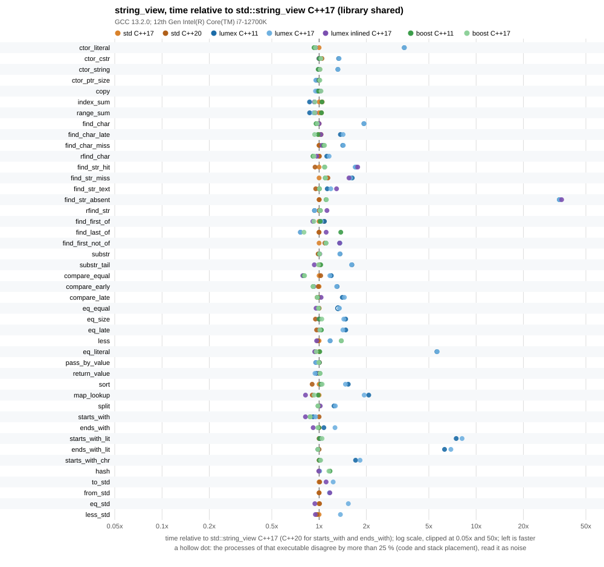
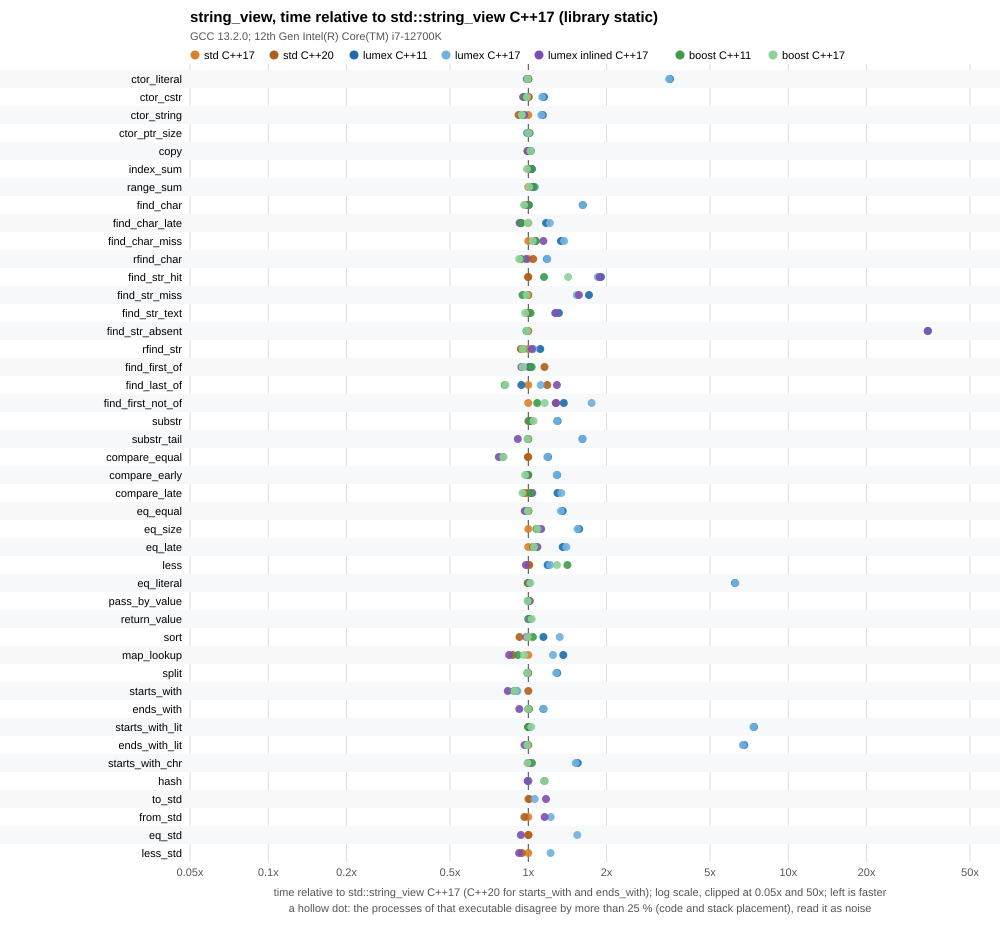
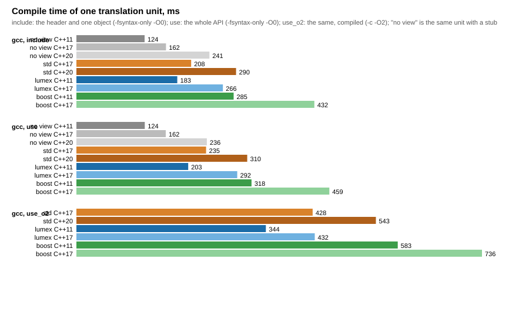

# string_view benchmarks

The string view of this library (`lumex_string_view`, `lumex::core::string_view::view`) against `std::string_view` of the standard library in use and `boost::string_view` of Boost.Utility, on the same scenarios and the same source. The view of this library is measured at C++11 and at C++17 (it is its own class at both and never becomes `std::string_view`); `std::string_view` at C++17 and at C++20 (`starts_with` and `ends_with` exist from C++20 only); `boost::string_view` at C++11 and at C++17. A fourth kind of build, "lumex inlined", compiles the two `.cpp` files of the view into the benchmark's translation unit instead of linking the library, to show what the compiled part costs. Only one toolchain was measured: GCC 13.2.0 with libstdc++. Clang with libc++ was not measured (the build supports it: a second build tree with `--build-dir clang=...`), so nothing here says how Clang or MSVC compile the same code.

The view has a compiled part (`libLumexCore_string_view`), so the library was built twice, as a shared library (the default of the library, `LUMEX_BUILD_SHARED_LIBS=ON`) and as a static one, and every executable was measured against both ("build tree" `shared` and `static`).







The numbers behind the charts: [results/string_view_benchmark.md](results/string_view_benchmark.md) (raw data: [results/string_view_benchmark.csv](results/string_view_benchmark.csv), layout and traits: [results/string_view_traits.csv](results/string_view_traits.csv), the compiled library: [results/library.csv](results/library.csv), compile times: [results/compile_time.csv](results/compile_time.csv)).

## Method

- One source, `bench_string_view.cpp`, compiled once per implementation and standard with `-DBENCH_STRING_VIEW_IMPL=1|2|3` (`bench_string_view_impl.hpp` maps it to the view under test; the "inlined" build adds `-DBENCH_LUMEX_UNITY`). Every variant is built with the flags of the Release profile of the library (`-O2 -DNDEBUG -fomit-frame-pointer -march=x86-64 -mtune=generic -fPIE` and the library warnings); there are no sanitizers. The build has no warnings. The library itself is built with the same profile.
- Scenarios (the unit of an operation is in the description column of the results): construction from a literal, a `char const *`, a `std::string` and pointer plus size; copy; the sum of the characters by `operator[]` and by range-for; `find` and `rfind` of a character and of a view, in short strings (33 to 36 characters, path-like) and in a text of 4 096 characters; `find_first_of`, `find_last_of`, `find_first_not_of`; `substr`; `compare`, `==` and `<` between views (equal strings in different buffers, a difference in the first and in the last character, different sizes) and with a literal; `starts_with` and `ends_with` with a view, a literal and a character; hashing; a `noinline` function that takes a view by value and one that returns a view; `std::sort` of 256 views; lookups in a `std::map` of 256 views; splitting a text of 4 096 characters at `,`; the conversions to and from `std::string_view` and the comparison with it. 44 scenarios in all. Each loop works on a corpus of 256 strings built at run time and every number is per operation.
- Equal work: before timing, every scenario is run for a few iterations and its checksum is compared with a reference that runs the same source on `std::string` objects (the same member functions on the same data); a mismatch stops the program. The checksums are written to the CSV and `run_benchmark.py` compares them across all executables of all build trees; different checksums stop the run. This makes the benchmark also a differential test of the views against `std::string` on 44 operations.
- The optimizer is kept from deleting or hoisting the work with empty `asm` statements that read the objects (`"m"`) and clobber memory, once per operation for objects that are created in the loop and once per pass over the 256 strings for sums. The corpus is built at run time, so no length or character is a compile-time constant, except in the scenarios that use a string literal on purpose (`ctor_literal`, `eq_literal`, `starts_with_lit`, `ends_with_lit`): there a view that sees the literal in the header can fold its length. This is the same for all implementations and it is the point of those scenarios.
- A scenario is calibrated until one run lasts at least 20 ms, then runs once as warm-up and 15 times for the numbers. The CSV keeps the median, the minimum and the maximum time per operation of the 15 repetitions; `run_benchmark.py` runs every executable `--passes` times (here 5), one pass over all executables after the other, and keeps the median of the medians, the smallest minimum and the largest maximum. The table keeps the best pass and marks (dagger) a value whose slowest pass was more than 25 % slower; 1 of 580 values are marked.
- The process is pinned to one CPU with `taskset` (`--cpu 3`). Every timing run, the build and the compile-time measurement were made under the build lock of the workstation, so the machine was otherwise idle.
- The baseline of the ratios is `std::string_view` at C++17 (at C++20 for `starts_with` and `ends_with`, which C++17 does not have). Every table cell is the absolute time in nanoseconds and, in parentheses, the ratio to the baseline (below 1.00 is faster than `std::string_view`). `std::string_view` was built and run in both build trees with the same code; the geometric mean of the ratio of its two runs is 0.998 (scenarios from 0.91 to 1.11), so a difference of 10 % between two numbers is within the noise of the machine.
- Layout: the executables write `sizeof`, `alignof` and a few traits of the narrow and the wide view (`--traits`).
- Compile time: `compile_time.cpp` is compiled in three units, `include` (the header and one declared object, `-fsyntax-only -O0`), `use` (construction, observers, searches, comparisons, slicing, `std::sort`, `std::map`, hashing, `-fsyntax-only -O0`) and `use_o2` (the same use compiled with `-c -O2`, with the `.text` of the object), next to the same unit with a stub instead of a view; the median of 7 runs. The unit of `std::string_view` at C++17 leaves out `starts_with` and `ends_with`.

## Boost

Boost is optional and header-only: the boost variants need `boost/utility/string_view.hpp` and are skipped, with a message, when CMake finds none. Pass the include directory with `-DLUMEX_BENCH_BOOST_INCLUDE_DIR=<dir>` or point `find_package(Boost CONFIG)` at an installation. Nothing of Boost is linked or vendored. On the workstation of the committed results Boost 1.92.0 is installed in `/opt/boost-1.92.0` (only its headers are used; hashing uses `boost/container_hash/hash.hpp`, also headers); the system also has Boost 1.67 in `/usr/include`, which was not used.

## Running

```sh
for kind in shared static; do
  cmake -S . -B build-bench-$kind -DCMAKE_BUILD_TYPE=Release \
        -DCMAKE_CXX_COMPILER=g++ -DLUMEX_BUILD_BENCHMARKS=ON \
        -DLUMEX_BUILD_SHARED_LIBS=$([ $kind = shared ] && echo ON || echo OFF) \
        -DLUMEX_BENCH_BOOST_INCLUDE_DIR=/opt/boost-1.92.0/include
  cmake --build build-bench-$kind --target LumexStringViewBench_lumex_cxx11 \
        LumexStringViewBench_lumex_cxx17 LumexStringViewBench_lumex_unity_cxx17 \
        LumexStringViewBench_std_cxx17 LumexStringViewBench_std_cxx20 \
        LumexStringViewBench_boost_cxx11 LumexStringViewBench_boost_cxx17
done
python benchmarks/string_view/run_benchmark.py \
       --build-dir shared=build-bench-shared --build-dir static=build-bench-static \
       --compile-time --compiler "gcc=g++" \
       --boost-include /opt/boost-1.92.0/include --cpu 3 --compile-repeats 7
```

The static build tree of the workstation was configured with `-DLUMEX_INSTALL=OFF`: with `LUMEX_BUILD_SHARED_LIBS=OFF` and the install rules on, the CMake generate step of the whole project failed on an unrelated module (`LumexApplied_settings` requires `nlohmann_json`, which is in no export set).

`run_benchmark.py` writes `results/string_view_benchmark.csv`, `results/string_view_traits.csv`, `results/library.csv`, `results/compile_time.csv` and, through `plot_results.py` (Python standard library only), the Markdown table and the SVG charts. The target `LumexStringViewBenchmarkRun` runs the executables of one build tree and writes into that build tree, so it never overwrites the committed results. `--filter <text>` on an executable runs the scenarios whose name contains the text.

## Reading the results

Measured on an Intel Core i7-12700K (Linux 6.1, pinned to one performance core), GCC 13.2.0 with libstdc++, Boost 1.92.0 (headers only), 5 passes, October 2026. The full table is in [results/string_view_benchmark.md](results/string_view_benchmark.md). A small absolute time (a few tenths of a nanosecond) is a handful of instructions and its ratio is coarse: 0.43 ns against 0.27 ns is one extra instruction or two.

- **Overall `lumex_string_view` is slower than `std::string_view`, and the reason is the compiled part.** The geometric mean of the time ratio of lumex C++17 to `std::string_view` C++17 over 44 scenarios is 1.55 with the shared library and 1.53 with the static one; lumex is more than 10 % slower in 33 (shared) and 33 (static) scenarios and more than 10 % faster in 1 and 0. The C++11 and the C++17 builds of the view are the same code and the same speed (geometric mean 0.99). `boost::string_view` is on par with `std::string_view` as a whole (geometric mean 1.00) with differences in both directions in single scenarios. With the "inlined" build, the same source code of the view is 1.10 of the time of `std::string_view` (shared tree): most of the gap is the call across the library boundary; what is left is mainly `find` of a view (see below).
- **Where lumex is much slower: a string literal.** A `std::string_view` or `boost::string_view` built from a literal in the same translation unit has a length the compiler knows: `ctor_literal` is 0.62 ns (a store of a constant), `eq_literal` 0.31 ns, `starts_with_lit` 0.46 ns. The constructor from `char const *` of `lumex_string_view` is in the compiled part: `strlen` runs at run time inside a call. The same operations take 2.17 ns (3.49x), 1.73 ns (5.66x) and 3.71 ns (8.14x); `ends_with_lit` is 6.91x. With the static library the numbers are 3.48x, 6.26x, 7.34x and 6.69x. In the "inlined" build the literal costs the same as in `std::string_view` (0.95x, 0.94x, 1.01x). A literal is the common argument of a text API (`view.starts_with ("methods/")`), so this is the case that most programs will meet. A `char const *` that is not a literal needs a `strlen` in every library (`ctor_cstr`: 3.81 ns against 2.84 ns, 1.34x with the shared library; the call is the difference).
- **Where lumex is slower: `find` of a view.** `find_str_text` (an 8-character view that is not in a text of 4 096 characters; its first letter occurs at every 16th position): 1720 ns against 1448 ns for `std::string_view` (1.19x) and 1457 ns for Boost; the inlined build needs 1871 ns, so this is the algorithm and not the call. `find (lumex_string_view)` of the library tests every position (a comparison of the first character, then `memcmp`); libstdc++ and Boost call `memchr` to jump to the next occurrence of the first character (read in `bits/string_view.tcc`), which pays when that character is rarer than every position. With a first letter that does not occur in the text at all (`find_str_absent`) `memchr` skips the whole text in one pass and `std::string_view` needs 28.63 ns against 969.6 ns here (33.9x). Both extremes are in the table, which one a program meets depends on the text. In short strings `find` of a view is 1.70x (hit) and 1.59x (miss); the inlined build is 1.76x and 1.55x, so these are the algorithm as well. `rfind` of a view (0.94x) has the same shape in all libraries.
- **Where lumex is slower by the call: the other members.** `find ('/')` is 3.36 ns against 1.74 ns (1.93x); the inlined build needs 1.74 ns. `substr` is 1.36x and `substr` of the tail 1.61x (it is a call that also may throw), construction from a `std::string` 1.32x (a two-field copy that is not inlined), `compare` 1.17x to 1.45x, `operator==` of equal strings 1.35x and of strings that differ late 1.42x, `operator<` 1.17x. `operator==` and the other five operators are inline, but they call the exported `compare`. In a program that sorts or looks up views the call is paid per comparison: `std::sort` of 256 views is 1.47x (shared) and 1.32x (static), a `std::map<view, ...>` lookup 1.94x (shared) and 1.25x (static), splitting a text with `find` and `substr` 1.27x. The inlined build is within a few percent of `std::string_view` for `sort` (1.03x) and `split` (1.02x) and faster for `map_lookup` (0.82x).
- **Where lumex is faster:** only `find_last_of` over a set of three characters (0.76x; Boost 0.80x); `find_first_of` (1.04x) and `starts_with` of a view (0.95x against `std::string_view` C++20) are within 10 %. The faster result is not merits of the design: libstdc++ implements the set searches with a `traits_type::find` (a `memchr` call) over the set for every character of the string, and the view of this library with two plain loops, which is faster for a short string and a set of three characters (read from `bits/string_view.tcc`; not measured on other sizes, and the loops do not scale to a long set). Boost is faster still on `find_last_of`.
- **Same as `std::string_view` within 10 %** (the rest): copy, construction from pointer and size, `pass_by_value`, `return_value` (a `trivially copyable` 16-byte object is passed in registers by all three, 0.68 ns for each), `index_sum` and `range_sum` (iteration is a pointer loop, the same code), hashing through the conversion.
- **The conversions to and from `std::string_view` cost a fraction of a nanosecond.** `to_std` is 0.77 ns against 0.62 ns for copying a `std::string_view`, `from_std` 0.85 ns against 0.73 ns (the inlined build: 0.69 ns and 0.85 ns, so the difference is placement at this size): the member templates are inline and move two words. The comparison with a `std::string_view` (`eq_std`: 1.54x, `less_std`: 1.37x) pays the exported `compare` like the comparison of two views. In the inlined build they are 0.94x and 0.95x.
- **Hashing.** `lumex_string_view` has no `std::hash`, so it cannot be a key of `std::unordered_map` as it stands; from C++17 a program hashes the `std::string_view` it converts to, which costs 4.68 ns against 4.64 ns for `std::hash<std::string_view>` (the same hash; the conversion adds nothing visible). `boost::hash<boost::string_view>` takes 5.36 ns (1.15x). The view cannot be hashed at C++11 without writing a hash function; the C++11 build has no `hash` scenario.
- **Shared against static library.** The static library changes little overall: the geometric mean of the time of lumex C++17 with the static library over the shared one is 0.985 (scenarios from 0.66 to 1.45). For `std::string_view`, which does not depend on the library and runs the same code in both trees, the same ratio is 0.998 (from 0.91 to 1.11), which is the noise to subtract. The calls are the most frequent in `map_lookup` (59.05 ns shared, 39.02 ns static) and `sort` (42.97 ns and 39.00 ns), where the PLT indirection shows. The static library does not remove the call (there is no link-time optimization in the library's build), only the PLT indirection.
- **Layout.** `sizeof` of every view is 16 bytes (a pointer and a size) for the narrow and the wide view in all three libraries; all are trivially copyable, trivially destructible and standard layout, and none is trivially default constructible. The implicit conversions match `std::string_view`: from a literal and from `std::string`, explicit to `std::string`; `lumex_string_view` and `std::string_view` convert into each other at C++17, `boost::string_view` does neither in version 1.92.0 (see `results/string_view_traits.csv`).
- **The compile time** of the header is a cost in most cases. At C++11 the view of this library is cheaper than Boost (the standard has none there). Over the same unit with a stub instead of a view (`-fsyntax-only -O0`): the `include` unit costs +59 ms for lumex C++11, +103 ms for lumex C++17, +46 ms for `std::string_view` C++17, +48 ms at C++20, and +162 ms (C++11) and +269 ms (C++17) for Boost. The `use` unit costs +79 ms (lumex C++11), +130 ms (lumex C++17), +73 ms (`std::string_view` C++17, without `starts_with` and `ends_with`), +73 ms (C++20) and +194 and +297 ms for Boost. At C++17 the header of this library includes `<string_view>` (for the conversions) on top of its own declarations, `<ostream>`, `<string>` and the library macros, so it is dearer than `<string_view>` alone there (+103 ms against +46 ms). The saving of the compiled part is in the code: the `use` unit compiled with `-c -O2` has 5398 bytes of `.text` with the view of this library at C++11 and 5499 at C++17, against 6723 (C++17, without `starts_with` and `ends_with`) and 7828 (C++20) for `std::string_view` and 10703 (C++11) and 10781 (C++17) for Boost. The same unit compiles in 344 ms (lumex C++11) and 432 ms (lumex C++17) against 428 ms (`std::string_view` C++17), 543 ms (C++20), 583 ms (Boost C++11) and 736 ms (Boost C++17): at C++17 the view of this library is not cheaper than `std::string_view` to compile. An earlier compile-time run on the same day (not saved) had the stub units about 15 % faster than the saved one; the ratios between the columns were the same, so read the deltas, not the absolute milliseconds.
- **The compiled library.** `libLumexCore_string_view.so` is 35288 bytes (23076 bytes of code) and exports 94 functions, 47 for the narrow and 47 for the wide view; it needs `libLumexCore_utility.so`. The static archive is 344396 bytes before and 57524 after `strip`; a program links only the members it uses.

## What the compiled part costs and what it saves

The whole class is exported (`class LUMEX_STRING_VIEW_API lumex_string_view`); only the accessors that are written in the header (`size`, `data`, `begin`, `end`, `operator[]`, `front`, `back`, `empty`, the copy and the constructor from pointer and size) and the six comparison operators are inline. `clear`, `remove_prefix`, `remove_suffix`, `swap`, the reverse iterators, `substr`, `at`, `copy`, every `find` and `compare`, `starts_with`, `ends_with` and the constructors from `char const *` and from `std::string` are calls into the library, including the ones that are one or two instructions.

- **Cost:** a library to build and link (35288 bytes shared, it needs the utility library at run time); a call per operation that the optimizer cannot see through, which is a geometric mean of 1.41 in time over the build of the same code inlined (shared library; 1.37 with the static one), with up to 8.14 times on literals, because the length of a literal cannot be folded; no `constexpr` for the constructor from `char const *`, the comparisons and the searches (`constexpr` objects and accessors only).
- **Saving:** less code per translation unit that uses the view (the `use_o2` unit above): 5499 bytes of `.text` against 6723 for `std::string_view` at C++17 (without `starts_with` and `ends_with`) and 7828 at C++20, in a unit that uses every member; the compile time of that unit at C++17 is the same as `std::string_view`'s. In the shared library there is a single copy of the algorithms in the process. On Windows the class is exported from one DLL and imported by the others (the per-module export macro `LUMEX_STRING_VIEW_API`), so that each DLL does not re-export the inline members; that is the design in `LumexExport.hpp` and was not tested here (a Linux machine).
- Inlining the compiled part would recover most of the speed (the "inlined" column) but the `find` of a view would stay slow; that is a separate change in the library, reported here and not made.

## Caveats

- The numbers are for this machine and this compiler, one toolchain (GCC 13.2.0, libstdc++). They are not a promise about Clang, MSVC, libc++, other CPUs or other versions: run the benchmark there (`Running`). In particular libc++ and MSVC's STL implement the searches differently from libstdc++.
- The scenarios measure a view in a loop with the optimizer held back by empty `asm` statements. They show the cost of the interface, not of a whole program. The corpus is short path-like strings (33 to 36 characters) and one text of 4 096 characters over 16 letters; strings of other lengths and alphabets can reorder close results, and the long-text search results depend on the letter frequencies.
- The "inlined" column is the library's own `.cpp` files included into the benchmark's translation unit. It is not what a user gets from the library as built, it only isolates the cost of the compiled part; with link-time optimization on both sides a user might get some of it.
- The wide view (`lumex_wstring_view`) is the same code with `wchar_t`; it was compiled and its layout was measured, but none of the timings use it.
- `starts_with` and `ends_with` are measured against `std::string_view` at C++20, the other scenarios against C++17.
- `hash` uses `std::hash<std::string_view>` for lumex (through the conversion) and for `std::string_view` and `boost::hash` for Boost, three different hash functions; only their speed is compared.
- The compile times are the median of 7 runs of one unit on an idle machine; the `std C++17` unit leaves out `starts_with` and `ends_with` and so does a little less work than the others.
